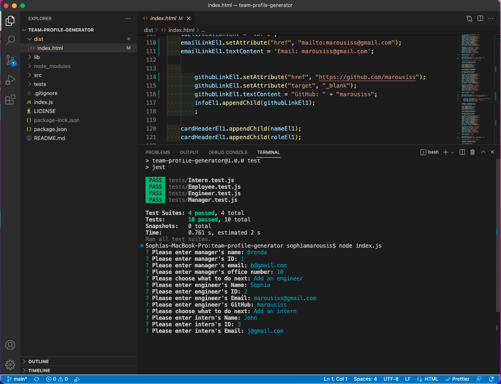
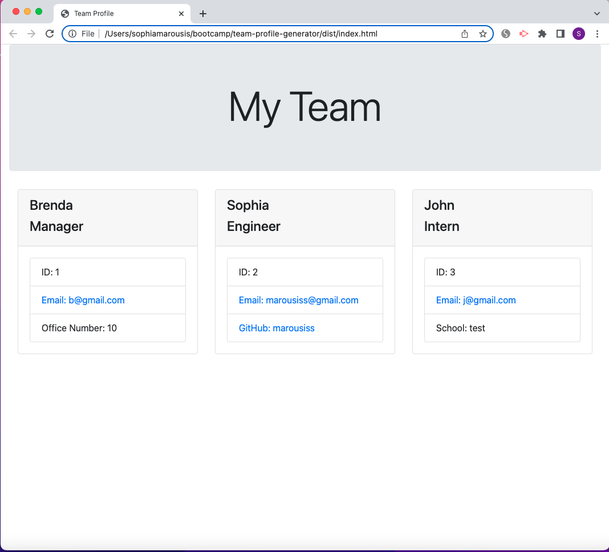

# Team Profile Generator

## Description

This is a command-line application that dynamically generates an index.html file from a user's input.

Video link: https://drive.google.com/file/d/19-b0mAmXBjBwYmNvrwbmVusVnr3i6ERC/view

## Installation

Please run `npm i` to install dependencies.

## Usage

To use this application please run `node index.js` in the command line.

## Credit

N/A

## Licence

Please refer to the LICENCE in the repo

